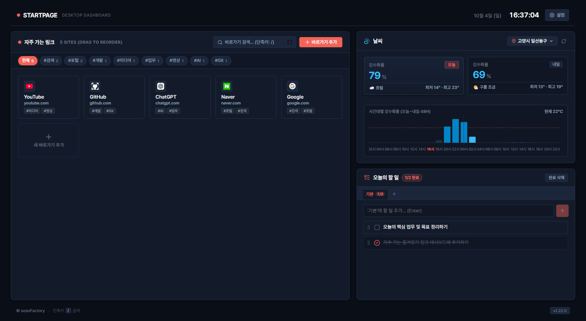

# 🚀 데스크톱 브라우저 시작 페이지 (Startpage Dashboard)

데스크톱 브라우저를 열었을 때 **자주 가는 링크(62% 메인 허브 & 스마트 태그)** 를 중심으로, **상세 지역의 날씨/강수확률 예보** 와 **오늘의 할 일(To-Do 다중 탭 관리)**, **실시간 디지털 시계** 를 한눈에 볼 수 있는 깔끔하고 정갈한 개인화 대시보드입니다.

---

## 🌐 접속 주소 (Live Demo)

- 🔗 **대시보드 바로가기**: **[https://sosofactory.github.io/start-page/](https://sosofactory.github.io/start-page/)**

---

## 📸 대시보드 미리보기



---

## ✨ 주요 기능 명세

### 1. 🔗 자주 가는 링크 허브 & 스마트 태그 시스템 (Main 62%)
- **5열 그리드 반응형 레이아웃**: 시각적으로 안정적인 카드 그리드로 바로가기 배치
- **스마트 태그 추천 & 정규화**:
  - 도메인/키워드 분석 기반 자동 태그 추천 (예: `#개발`, `#AI`, `#미디어`, `#업무` 등)
  - 테크/금융 약어 표준 대문자 변환(`AI`, `UI`, `UX`, `API`, `AWS`, `DB`, `SQL` 등) 및 영단어 Title Case(`Git`, `Notion`) 정규화
  - 대소문자 무시(Case-Insensitive) 통합 집계로 중복 없는 깔끔한 태그 클라우드 제공
- **태그 클라우드 필터링 & 동적 더보기**:
  - 상단 태그 칩 클릭 시 해당 태그 북마크만 즉시 필터링
  - 태그가 2줄을 초과할 경우 높이 변화를 실시간 감지하여 `+N개 더보기 / 접기` 토글 자동 제공 (가로 스크롤 없음)
- **실시간 인라인 검색 & 필터링**: 별도 버튼 클릭 없이 키워드 입력 즉시 실시간 대조 필터링 및 원클릭 지우기(`X`) / `ESC` 초기화 지원
- **HTML5 네이티브 드래그 앤 드롭**: 마우스 드래그로 타일 순서를 자유롭게 재배치 (로컬스토리지 자동 저장)
- **전체 URL 경로 표시 & 호스트 볼드 강조**: 도메인 호스트는 굵게(Bold), 세부 경로는 은은한 톤으로 자연스럽게 표시하며 말줄임표(`...`)로 레이아웃 보호
- **견고한 파비콘 Fallback**: 외부 파비콘 로딩 실패 또는 범용 플랫폼(GitHub Pages, Vercel 등) 환경 시 깨진 이미지 대신 도메인/사이트명 기반 **스마트 이니셜 배지** 로 자동 전환

### 2. 📝 오늘의 할 일 위젯 (To-Do List with Multi-Tabs)
- **다중 탭(Multi-Tab) 시스템**:
  - 업무, 개인, 프로젝트 등 주제별로 탭을 생성(`+` 버튼)하여 할 일 분리 관리
  - 탭 더블클릭/수정 아이콘으로 이름 변경, `X` 버튼으로 간편 삭제 (삭제 시 기존 항목은 기본 탭으로 안전 이전)
  - 탭별 진행 현황(`완료/전체`) 실시간 카운트 배지 표기
- **자유로운 순서 변경 (Drag & Drop Reorder)**:
  - 각 항목 앞단의 은은한 드래그 핸들(`GripVertical`)로 마우스를 끌어 순서 재배치
  - 가로 흔들림 없는 완벽한 수직(Y축) 드래그 인터랙션
- **편리한 할 일 제어 & 탭 간 이동**:
  - 체크박스뿐만 아니라 **텍스트 클릭 시에도 원클릭 완료 토글**
  - 항목 호버 시 이동 버튼(`ArrowRightLeft`)을 통해 다른 탭으로 즉시 이전
  - 인라인 수정(`Pencil`), 개별 삭제(`Trash2`), 완료된 항목 일괄 `완료 삭제` 지원

### 3. 🕒 헤더 실시간 디지털 시계 (`HeaderClock`)
- **모던 대형 타이포그래피**: 답답한 박스 없는 개방형 타이포그래피(`18px` Bold, `tabular-nums`) 적용
- **1초 간격 실시간 갱신**: 실시간 날짜(월/일/요일) 및 12h/24h, 초 단위 표시 설정 연동

### 4. 🌦️ 날씨 & 강수확률 예보 위젯 (Widget 38%)
- **전국 250+ 시/군/구 상세 지역 날씨**: 기상청/Open-Meteo 연동 (기본값: 고양시 일산동구)
- **오늘 & 내일 대표 요약**: 강수확률, 날씨 아이콘, 최저/최고 기온 명문화 (`최저 18° · 최고 26°`)
- **48시간 시간대별 강수 바 차트**: 2시간 단위 시간대별 강수확률 시각화 및 현재 시간대 하이라이트

### 5. ⭐ 툴바 별(Star) 아이콘 미니 팝업 바로가기 추가 (Chrome Extension)
- **1초 만에 스마트 바로가기 등록**: 웹서핑 중 브라우저 툴바의 **산호색 별(⭐) 아이콘을 클릭** 하면 현재 페이지 제목, URL, **스마트 추천 태그** 가 자동 입력된 미니 팝업이 표시됩니다.
- **팝업 내 태그 편집 & 추천 칩 추가**: 원하는 태그를 추가/삭제하거나 추천 태그를 원클릭으로 선택 가능
- **실시간 무중단 동기화**: 팝업에서 추가한 링크는 이미 열려있는 새 탭 대시보드에 새로고침 없이 즉각 실시간 반영됩니다.

### 6. ⚙️ 종합 설정 및 데이터 관리 모달 (`SettingsModal`)
- **원클릭 환경설정**: 링크 새 탭 열기(`_blank`/`_self`), 디지털 시계 포맷(12h/24h/초) 제어
- **북마크 백업 & 복원**: JSON 파일 내보내기/가져오기 및 기본 5개 프리셋으로 초기화 지원
- **사용 가이드 & 로컬 보안 안내**: 툴바 별(⭐) 아이콘 팁 및 100% 로컬 데이터 보안 원칙 안내

### 7. 🌿 Saniti Light & Dark 미니멀 디자인 시스템
- **다크 테마 (Dark Theme) & OS 실시간 동기화**:
  - `시스템 (자동)`, `라이트`, `다크` 3가지 테마 모드 지원
  - OS 다크 모드 전환 시 실시간 동기화 및 Slate 딥 다크 팔레트로 눈의 피로 최소화
- **100vh 무스크롤 뷰포트**: 한 화면에 모든 정보를 압축하여 스크롤 없는 완벽한 데스크톱 대시보드 구현
- **Pretendard 전면 적용**: 가독성이 뛰어난 Pretendard(프리텐다드) 단일 서체 시스템 구축
- **모던 커스텀 툴팁 (`[data-tooltip]`)**: 브라우저 기본 `title` 속성을 배제하고 아이콘 전용 버튼에 부드러운 다크 툴팁 제공
- **공통 모달 컴포넌트 & 애니메이션 (`Modal.tsx`)**: 일관된 `ESC` 닫기 지원 및 자연스러운 팝인 애니메이션

---

## 🛠️ 브라우저 홈(시작 페이지)으로 설정하는 2가지 방법

### 🌟 [방법 1] GitHub Pages 웹 주소로 설정하기 (가장 추천)

컴퓨터를 켤 때마다 로컬 서버를 실행할 필요 없이 언제나 즉시 열리는 방식입니다.

#### 브라우저 시작 페이지에 등록
- **Chrome (크롬)**:
  1. 우측 상단 `⋮` ➔ **[설정]** ➔ 좌측 **[시작 그룹]** 클릭
  2. **`특정 페이지 또는 페이지 모음 열기`** 선택 ➔ **`새 페이지 추가`** 클릭
  3. URL 입력: `https://sosofactory.github.io/start-page/`
- **Edge (엣지)**:
  1. 우측 상단 `...` ➔ **[설정]** ➔ 좌측 **[시작, 홈 및 새 탭]** 클릭
  2. **`Edge가 시작될 때`** 항목에서 **`다음 페이지를 열 수 있음`** 선택 ➔ URL 입력

> 💡 **새 탭(`Ctrl + T`)을 열 때마다 이 화면이 뜨게 하려면?**  
> 크롬 웹스토어에서 무료 공식 확장 프로그램인 **[New Tab Redirect]** 설치 후, 주소 칸에 `https://sosofactory.github.io/start-page/`를 넣으시면 새 탭을 누를 때마다 이 시작 페이지가 0초 만에 열립니다.

### 🚀 [방법 2] 크롬 확장 프로그램으로 등록하기 (오프라인 / 로컬 네이티브 새 탭)

인터넷 연결이나 서버 없이, 브라우저에 `dist` 폴더를 직접 확장 프로그램으로 등록하여 새 탭으로 사용하는 방식입니다.

1. **프로젝트 빌드**: `npm run build`
2. **브라우저 확장 프로그램 관리자 접속**: `chrome://extensions` (Chrome/Whale) 또는 `edge://extensions` (Edge)
3. 우측 상단 **`[개발자 모드]`** 켜기
4. 좌측 상단 **`[압축해제된 확장 프로그램을 로드합니다]`** 클릭 ➔ 빌드된 **`dist` 폴더** 선택
5. 완료! 이제 새 탭(`Ctrl + T`)을 열면 대시보드가 즉시 열리며, 웹서핑 중 툴바의 **별(⭐) 아이콘을 눌러 언제든 현재 사이트를 바로 추가** 할 수 있습니다.

---

## 🧪 로컬 개발 및 단위 테스트 (TDD)

```bash
# 로컬 개발 서버 실행
npm run dev

# 전체 TDD 단위 테스트 실행 (11개 파일, 53개 테스트 100% Pass)
npm test

# 프로덕션 빌드
npm run build
```
